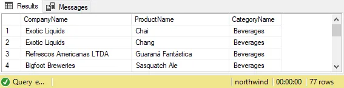

# Optional Challenge · The Product Catalog

**You can build the product catalog from a blank query window, by hand.**

This is **100% optional, and there is nothing to submit** — nobody collects
it, nobody grades it, and nothing bad happens if you skip it. It exists for
exactly one person: you. That said, we **highly recommend** you do it — if
you want to walk into Monday with the six words already living in your
fingers instead of your notes, this is the rep that puts them there.

## The Ask

Typed from scratch — deck closed, no copying:

> Create a query that retrieves all the Supplier Company Names, Product
> Names, and Category Names in one table, with the Category Names in
> ascending order.

## The Proof

The result should look like this:

**77 rows**, with `Exotic Liquids · Chai · Beverages` at the top.

Wrong row count or a different top row? The data did what you said, not
what you meant — reread, rerun. The We-do section of the workshop deck
builds this exact query one arrow at a time if you need the road back.

## When You've Got It

Nothing to turn in. Your proof is the screen in front of you: 77 rows,
Chai on top. Close the query window, and know that Monday-you is going
to thank Friday-you.

## Level Up (also optional, also recommended)

- Write it again tomorrow, from memory. It goes faster the second time.
- Time yourself. Then beat your time.
- Then invent one question of your own — any table on the map — and make
  Northwind answer it.
